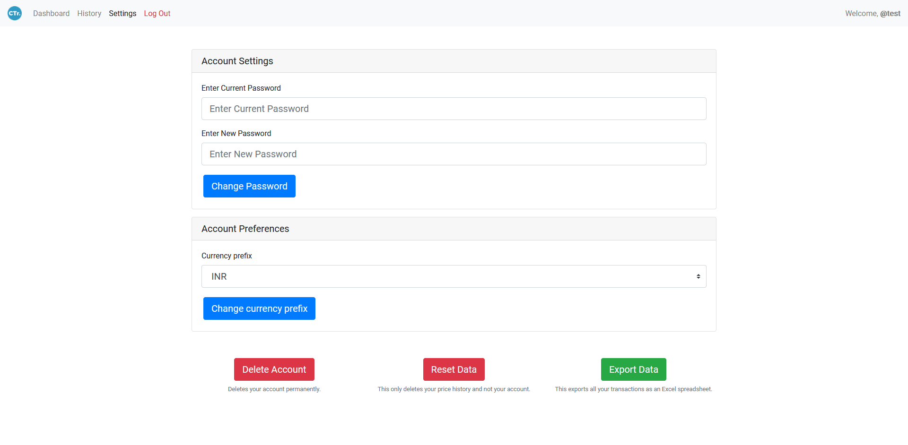
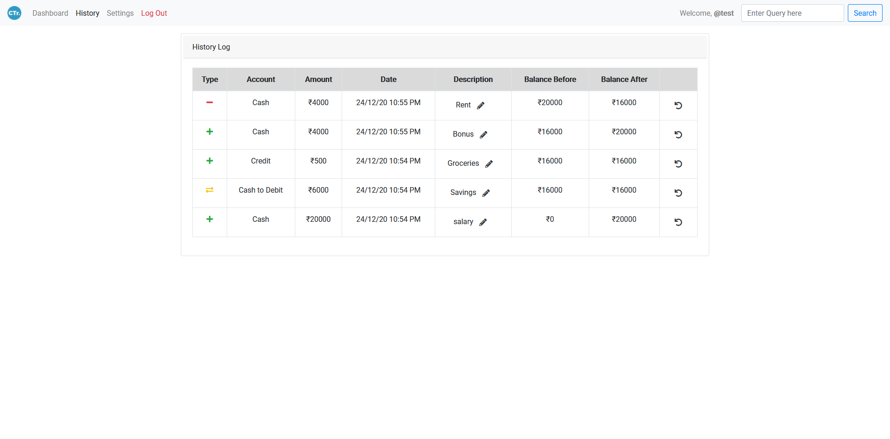
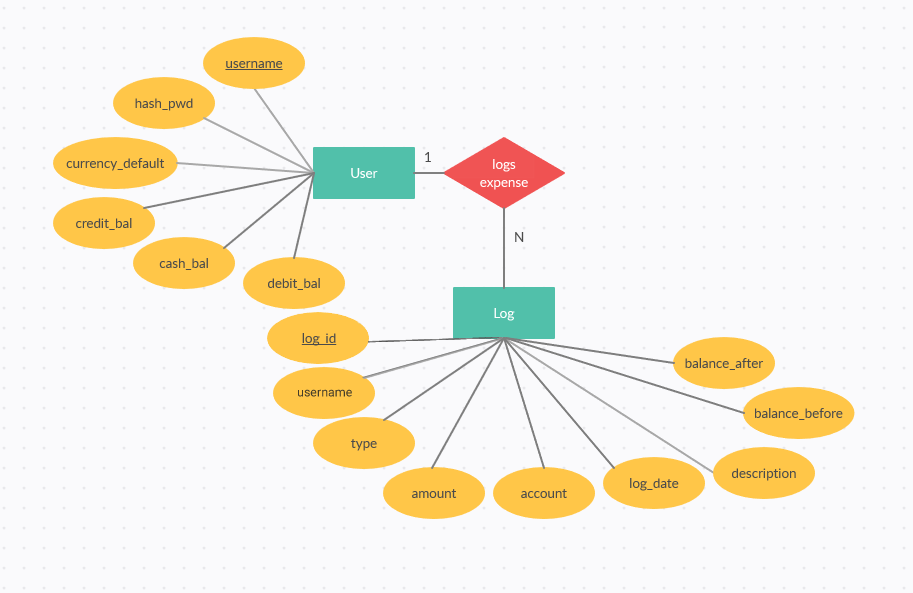

# CashTrack - University Mini project  

A Web app to help manage your budget and expenses.  

### [Check Deployment here.](https://cashtrk.000webhostapp.com/)

## Features   
* Log in/Sign up
* Keep multiple wallets
* Add/Subtract/Transfer balances
* Show graphical representation of balance
* View, search, update and delete history.
* Modify account settings
* Export as Excel spreadsheet

## Tech Stack
* HTML/CSS/JS for static pages
* Bootstrap for easy to use components
* JQuery for modal dialogs
* PHP for server side backend
* Mysql database
* Google Charts for graphs
* 000webhost for deployment

## Contribution
* [Sarath S](https://github.com/Sharkaboi) - System Design/Backend/DB
* [Ashwin Cherukat](https://github.com/LegolasGreenleaf1999) - UI/UX/Frontend

## Screenshots
Home Page            |  About Page 
:-------------------------:|:-------------------------:
  |  
Log in Page            |   Sign Up Page
  |  
FAQ page            |  Dashboard Page 
  |  
Add Balance Dialog            |  Subtract balance dialog
  |  
Transfer Balance Dialog            |  Settings Page
  |  
History Page            |  404 Page 
  |  

## Backend 
Schema            |  Navigation & data flow
:-------------------------:|:-------------------------:
  |  
User table           |  Log table
  |  

## Folder structure 
Folder structure          |
:-------------------------:
 

## Workflow log
* Requirement planning - Planned requirements for design and initial prototyping.
* Initial Design - [Made in Adobe XD](https://xd.adobe.com/view/b3a25f63-7351-48d7-6755-3f443c68c410-c593/?fullscreen)
* Resources Acquirement - Used free [Iconscout](https://iconscout.com/) illustrations and icons.
*  Deployment setup with [000webhost](https://000webhost.com/).
* [DB Schema design](https://github.com/Sharkaboi/CashTrack/blob/main/assets/screenshots/schema.png)
* Front-end coding - Added Home, Login and Sign up pages.
* DB coding - Mysql tables are set up.
* System design - Log in session management.
* Backend coding - Setup login and sign up flow.
* Backend coding - Setup log out flow.
* Backend coding - Setup up dashboard page.
* Backend coding - Setup Google Charts JS.
* Backend coding - Setup up add and subtract balance.
* Backend coding - Setup up history page with search.
* Front-end coding - Added 404 page.
* Backend coding - Added password change functionality.
* Backend coding - Added currency prefix change functionality.
* Backend coding - Added reset data functionality.
* Backend coding - Added reset account functionality.
* Backend coding - Added transfer balance functionality.
* Backend coding - Added update description functionality.
* Front-end coding - Added about page.
* Front-end coding - Added FAQ page.
* Backend coding - Added undo transaction functionality.
* Testing - Fixed search, balance, update description bugs.
* Additional features - Added export as excel spreadsheet option.
* Deployment - Deployed to 000webhost.


## License 
```
MIT License

Copyright (c) 2020 Sarath S

Permission is hereby granted, free of charge, to any person obtaining a copy
of this software and associated documentation files (the "Software"), to deal
in the Software without restriction, including without limitation the rights
to use, copy, modify, merge, publish, distribute, sublicense, and/or sell
copies of the Software, and to permit persons to whom the Software is
furnished to do so, subject to the following conditions:

The above copyright notice and this permission notice shall be included in all
copies or substantial portions of the Software.

THE SOFTWARE IS PROVIDED "AS IS", WITHOUT WARRANTY OF ANY KIND, EXPRESS OR
IMPLIED, INCLUDING BUT NOT LIMITED TO THE WARRANTIES OF MERCHANTABILITY,
FITNESS FOR A PARTICULAR PURPOSE AND NONINFRINGEMENT. IN NO EVENT SHALL THE
AUTHORS OR COPYRIGHT HOLDERS BE LIABLE FOR ANY CLAIM, DAMAGES OR OTHER
LIABILITY, WHETHER IN AN ACTION OF CONTRACT, TORT OR OTHERWISE, ARISING FROM,
OUT OF OR IN CONNECTION WITH THE SOFTWARE OR THE USE OR OTHER DEALINGS IN THE
SOFTWARE.

```
